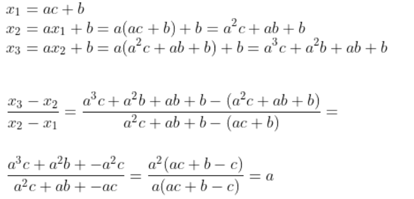

# Solution
- We have the following equations for each character `c` in the flag that lets us calculate `a`.

(everything is modulo p)
- So we can find `a` by calculating the difference between `x_3` and `x_2` and multiplying it by the modular inverse of the difference between `x_2` and `x_1`.
- Then we can find `b` by substituting `a` in the equation $x_2=ax_1 + b$.
- Finally we can reverse each number of `enc[1]` by subtracting `b` and multiplying the result by the modular inverse of `a` to find the flag.


```py
p=594682003472506879
x1=enc1[0]
x2=enc2[0]
x3=enc3[0]
# Calculate a
a = ((x3 - x2) * pow(x2 - x1, -1, p)) % p
# Calculate b
b = (x2 - a * x1) % p
assert (x3 == (a * x2 + b) % p) and (x2 == (a * x1 + b) % p)    
print(a,b)
dec=[(i-b) * pow(a,-1,p)%p for i in enc1]
print(bytes(dec))
```