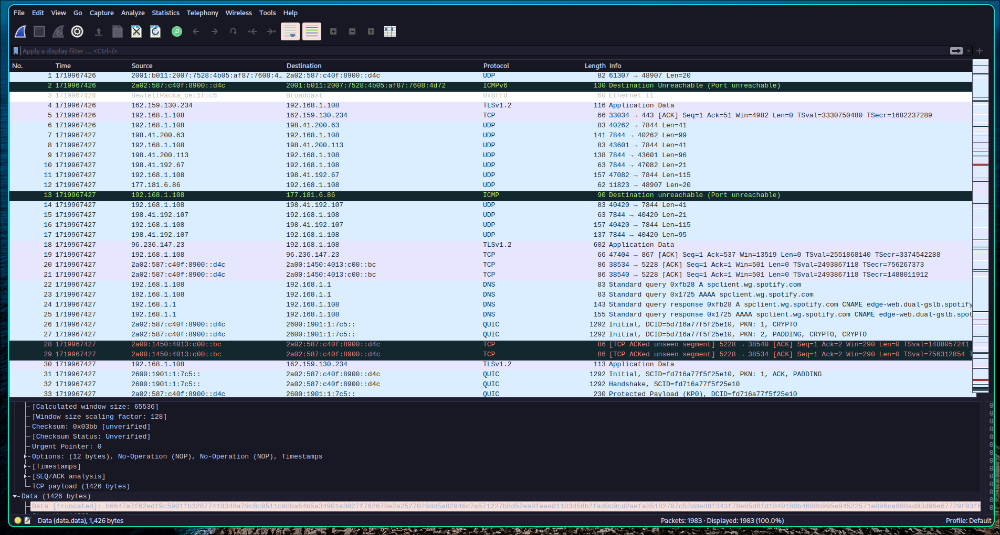
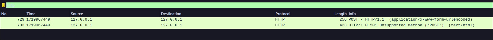
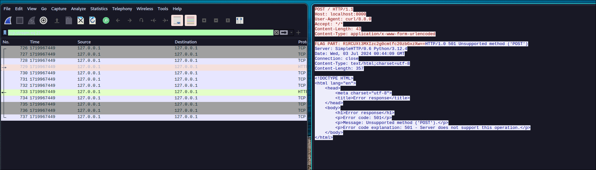
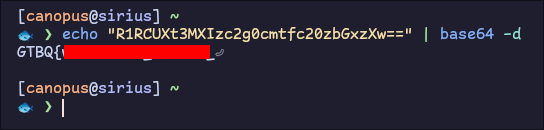
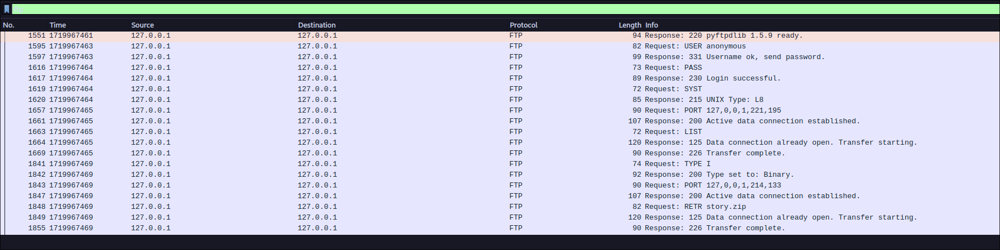
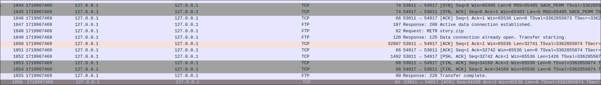
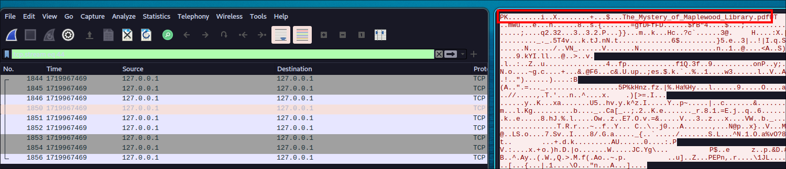
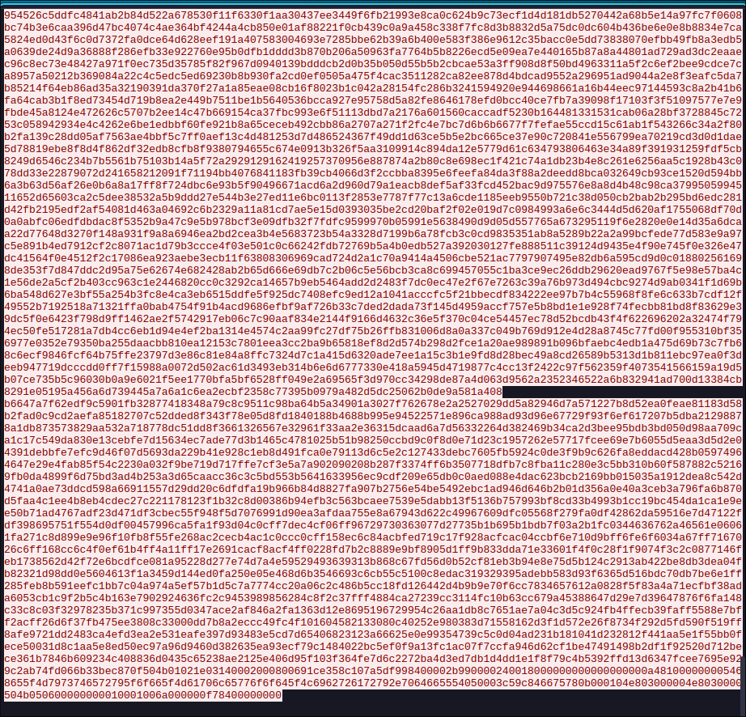
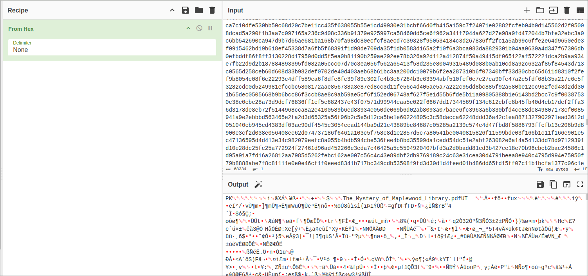

# Sharks Meet the Wire

We are given a `capure.pcapng` file for us to analyze. Let's fire up Wireshark!

It's a little bit messy, so how can we clean this up? The description hints us for `requests` and `downloaded` files. So let's look at the former first.

With the filter `http` we can show only `HTTP Requests`:

We only find a single `HTTP` request along with its reply. So let's right click and select `Follow HTTP Stream` (or `Follow TCP Stream`):

This will isolate the packets needed for this `TCP` stream and also display the request/reply in a printable manner.

In the request part (Red) we can find the first part of the flag as annotated. We need only to decode it from base64:

Now for the second part, let's backtrack a bit. We know we are looking for downloaded files. No files were downloaded from an `HTTP` server, because we would've seen that request in the `http` filter. The other popular ways to serve files is `SMB/NFS` but filtering for those returns nothing.

Let's try filtering for `FTP` transfers:

Bingo! We have a file transfer that took place, downloading `story.zip` from a public share (`anonymous` login).

However, when we try and export that we cannot get Wireshark to detect it...

The description also hints us to be careful about `new-lines`. Why would we need to care about this though?

The only logical explanation is that we should do some form of file carving and we have to skip the new-line characters. The `TCP` protocol runs over `TCP`, where the actual data of the packets is being transferred, and where our `zip` transfer took place.

For that, let's remove the `ftp` filter and look around the `1849-50` packets:

 

Here we can find two rather large `TCP` packets that appear between `Transfer Starting` - `Transfer Complete`. These are the packets we care for.

As previously, let's follow the `TCP Stream`:

We can confirm that these are the important packets, because of the signature of the `zip` file: `PK`

Now how can we convert such data back into a zip?

We can change how Wireshark displays the data, and instruct it to display it as hexadecimal values using the `Show data as: Raw` setting in the current window:

Towards the end we find the raw value breaking in (aka new-line). So when converting we should avoid them.

For converting we can use a popular online tool called [CyberChef](https://gchq.github.io/CyberChef) and use its `From Hex` Recipe and paste inside the hex values having copied them from here:

We can see it decoded the hex values back into a zip and also if we hover over the `Magic Wand` it will also confirm it for us `PKZIP`.

From there we can download the `zip` and extract it into a `PDF` file and get the 2nd part of the flag:

