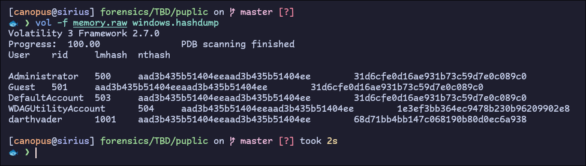
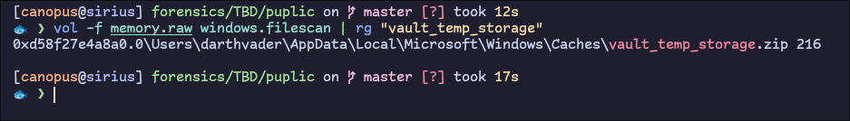
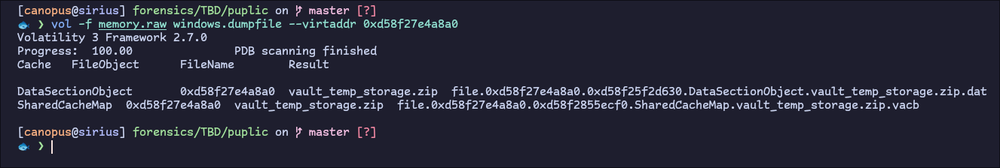
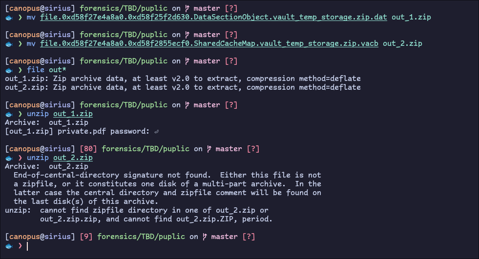

# Volatile Memory

We are given a memory image to analyze. We will be using [volatility3](https://github.com/volatilityfoundation/volatility3) for this, a memory analysis framework.

We need 3 things to get the flag:

- username
- password
- `md5sum` of `vault_temp_storage.zip`

The first two are really easy. Since this is a Windows memory dump (from Administrator/Guests accounts) we can dump the `NT-Hashes` for all users and then attempt to crack them. We can use volatilitys `windows.hashdump` plugin to dump the hashes and users:



We are told to ignore the built-int accounts so the username in question is `darthvader`.

To find the password we need to crack the `nthash` of the user. `nthash` is basically `MD4(UTF-16-LE(password))` of the password and we can use [hashcat](https://hashcat.net/hashcat/) or [john](https://www.openwall.com/john/) for this.

**Note:** If you need to brute-force a hash, the convention is to use `rockyou.txt` unless specified otherwise

```bash
$ hashcat -d 2 -a 0 -m 1000 hash /usr/share/dict/rockyou.txt

[...]

68d71bb4bb147c068190b80d0ec6a938:lovefamilycash

Session..........: hashcat
Status...........: Cracked
Hash.Mode........: 1000 (NTLM)
Hash.Target......: 68d71bb4bb147c068190b80d0ec6a938
Time.Started.....: Wed Jul  3 23:59:42 2024 (1 sec)
Time.Estimated...: Wed Jul  3 23:59:43 2024 (0 secs)
Kernel.Feature...: Pure Kernel
Guess.Base.......: File (/usr/share/dict/rockyou.txt)
Guess.Queue......: 1/1 (100.00%)
Speed.#2.........: 14690.5 kH/s (3.24ms) @ Accel:1024 Loops:1 Thr:64 Vec:1
Recovered........: 1/1 (100.00%) Digests (total), 1/1 (100.00%) Digests (new)
Progress.........: 6291456/14344384 (43.86%)
Rejected.........: 0/6291456 (0.00%)
Restore.Point....: 5898240/14344384 (41.12%)
Restore.Sub.#2...: Salt:0 Amplifier:0-1 Iteration:0-1
Candidate.Engine.: Device Generator
Candidates.#2....: madrsa -> lee2204
Hardware.Mon.#2..: Temp: 64c Util: 22% Core: 800MHz Mem:2800MHz Bus:16

Started: Wed Jul  3 23:59:31 2024
Stopped: Wed Jul  3 23:59:43 2024
```

Now we have found the password as well `lovefamilycash`.

The last piece of the flag is finding the `md5sum` of `vault_temp_storage.zip`.

Volatility provides us with `windows.filescan` and `windows.dumpfile` plugins that we can use to enumerate all files cached in the target memory and if so **try** to carve them out.



We are given the physical / virtual address as the first column and we can use that to dump the file from memory:



However this dumped two files of different size! The description guides us, as to proceed with the non corrupted one so let's rename them first and then try to unzip them:



We can see that `out_1.zip` prompts us for a password, while `out_2.zip` errors out. So we take the `md5sum` of `out_1.zip`:

```bash
$ md5sum out_1.zip
7cb6363689310bdbd379fcb9fb1c17d2  out_1.zip
```

And with that, we have all 3 parts of the flag!
