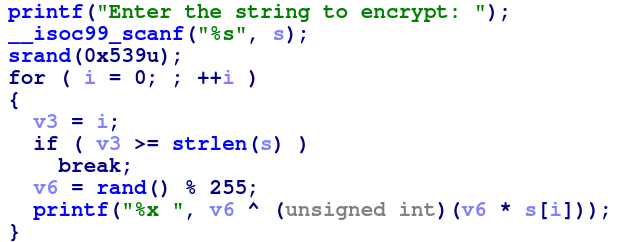

# Solution:
- We view the decompilation from [IDA](https://www.hex-rays.com/products/ida/support/download_freeware/) :
- It does some operations and then prints each number in hexadecimal format.
- Since it's using rand() with a predefined seed, we can replicate the random numbers generated by the program.
- Just remember that python's random isn't the same as C's rand() function, so we either need to run the solver in C:

```c
#include<stdio.h>
#include<stdlib.h>
#include<string.h>
#include<stdlib.h>
/* python
print(f'int out[{len(out)}] = {"{"}',end=' ')
for o in out:
    print(f'{int(o,16)}, ',end=' ')
print('};')
*/

int main(){
    int out[22] = { 7270,  8478,  4357,  18144,  2960,  24699,  6242,  29908,  400,  10769,  12512,  11488,  9831,  12381,  13176,  8320,  8332,  286,  11349,  9556,  12074,  12960,  };
    srand(1337);
    for (int i = 0; i < 22; i++){
        int x=rand();
        x=x% 255;
        printf("%c", (out[i] ^ (x))/x);
    }
}
```
- Or we can import a C library in python to use the rand() function.
```python
from ctypes import CDLL
libc = CDLL("libc.so.6")
libc.srand(1337)
out='1c66 211e 1105 46e0 b90 607b 1862 74d4 190 2a11 30e0 2ce0 2667 305d 3378 2080 208c 11e 2c55 2554 2f2a 32a0'.split()
for o in out:
    x=libc.rand()%255
    print(chr((int(o,16)^x)//x),end='')
```